# Arquitectura — Currícula Viva

Los diagramas se generan desde los `.puml` de esta misma carpeta:

```bash
cd docs
java -jar plantuml.jar -tpng *.puml
```

`comun.puml` define la paleta y se incluye en todos.

| # | Diagrama | Fuente | Imagen |
|---|---|---|---|
| 1 | Casos de uso | `1_casos_uso.puml` | `1_casos_uso.png` |
| 2 | Componentes | `2_componentes.puml` | `2_componentes.png` |
| 3 | Clases y puertos | `3_clases.puml` | `3_clases.png` |
| 4 | Secuencia | `4_secuencia.puml` | `4_secuencia.png` |
| 5 | Actividad | `5_actividad.puml` | `5_actividad.png` |
| 6 | Despliegue | `6_despliegue.puml` | `6_despliegue.png` |
| 7 | Estados | `7_estados.puml` | `7_estados.png` |

---

## 1. Casos de uso

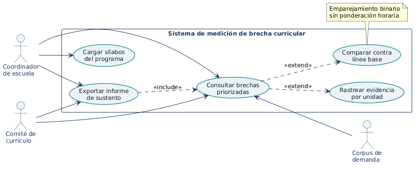

## 2. Componentes y frontera de despliegue

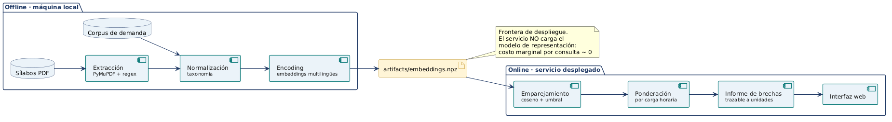

## 3. Modelo de dominio y puertos

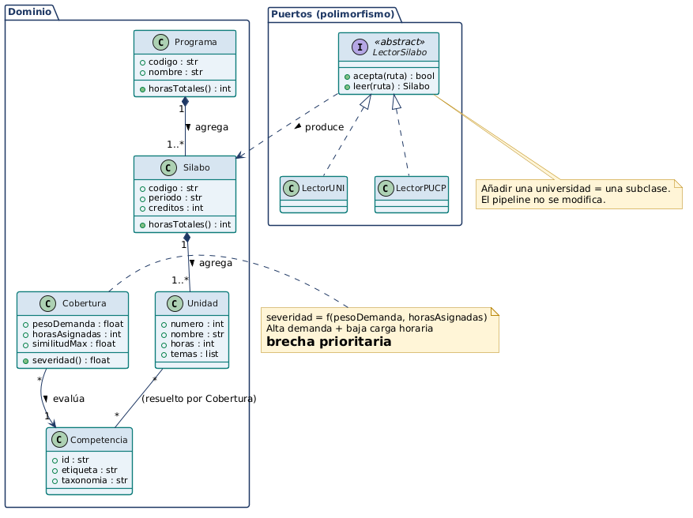

## 4. Secuencia de una consulta

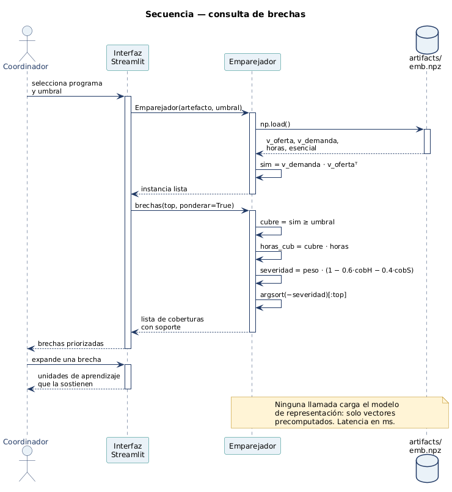

## 5. Actividad del pipeline offline

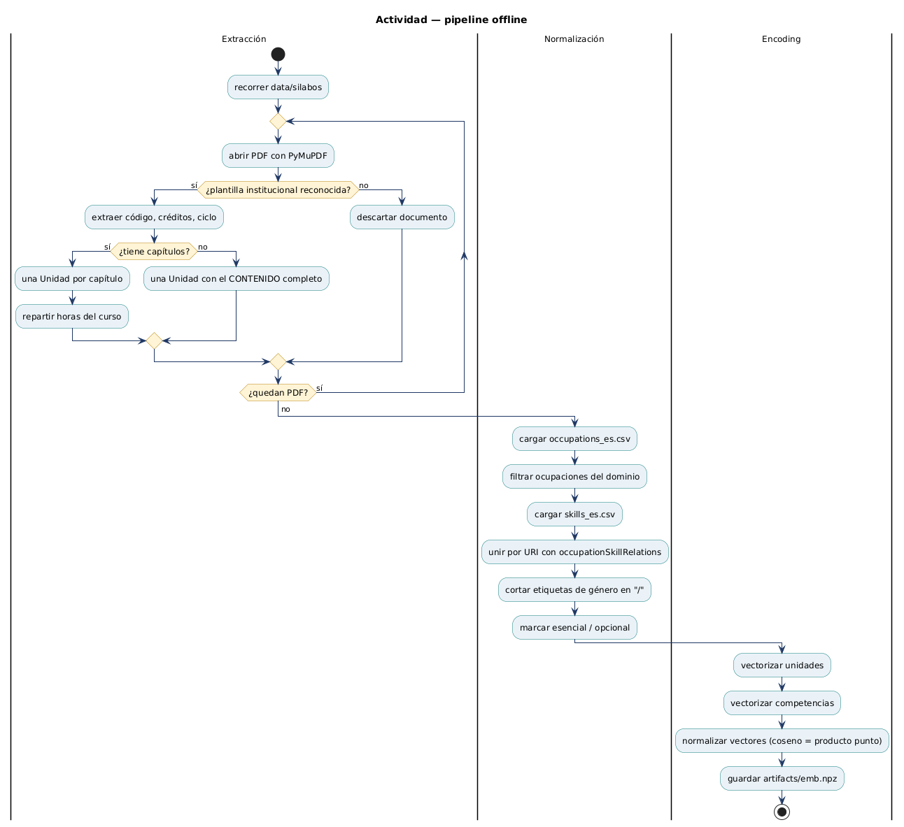

## 6. Despliegue

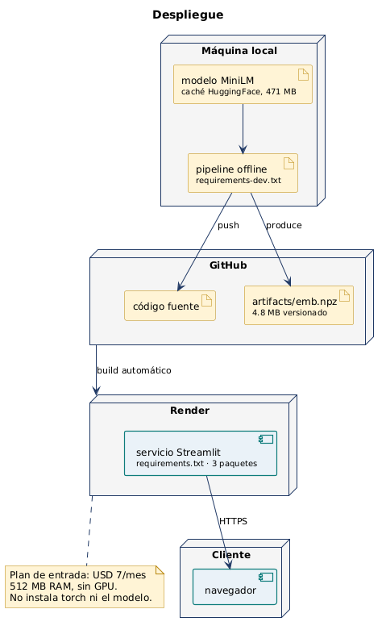

## 7. Estados de una competencia

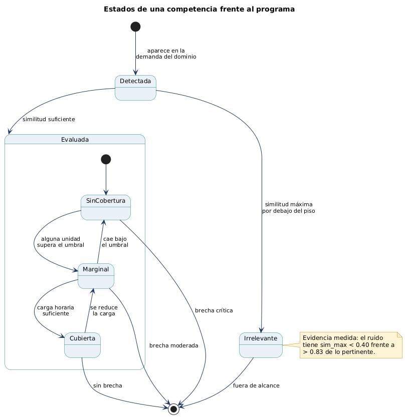

---

Los bloques Mermaid siguientes son una vista alternativa embebida.

## Vista de componentes

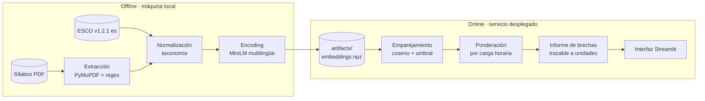

El artefacto marca la frontera de despliegue. El servicio no carga el modelo
de representación: runtime de tres paquetes, sin torch. Verificado.

## Modelo de dominio

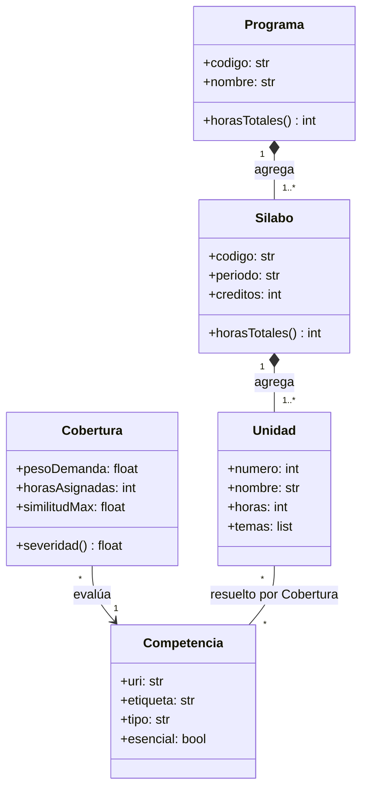

## Puertos y adaptadores

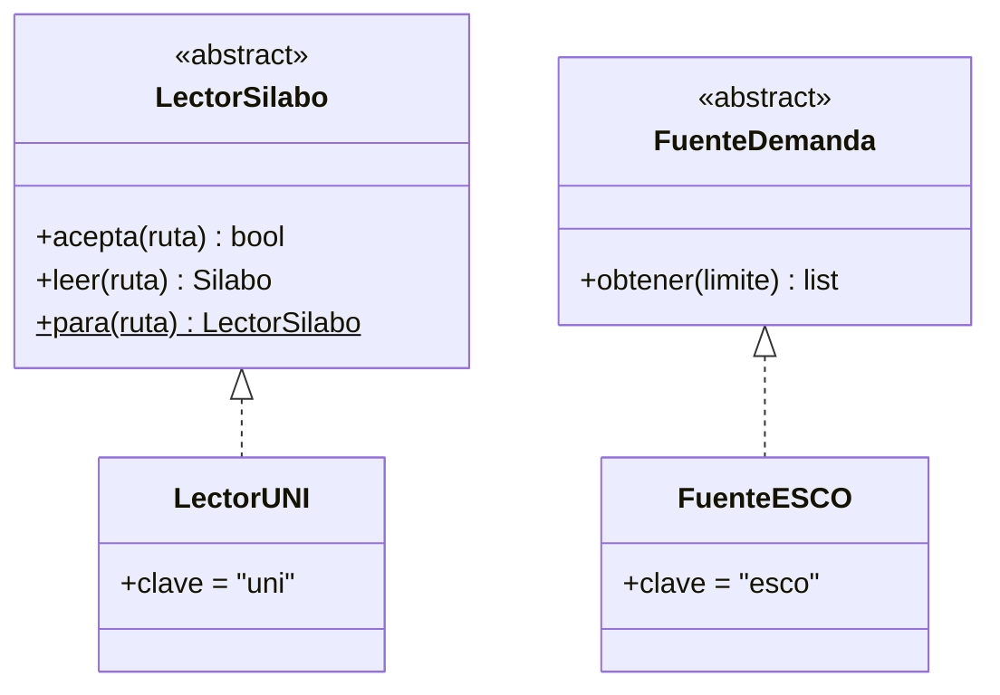

Las subclases se auto-registran mediante `__init_subclass__`, de modo que el
despacho ocurre sin cadenas de condicionales. Incorporar otra universidad
requiere una subclase nueva y ningún cambio en el pipeline: ese es el
mecanismo de escalabilidad, no una promesa.

## Flujo de una consulta

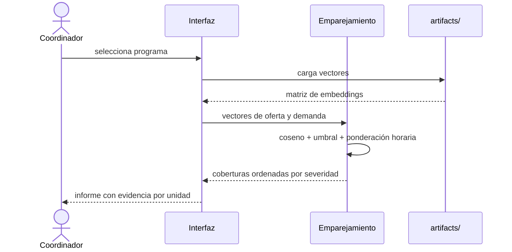

## Decisiones y alternativas descartadas

| Decisión | Alternativa | Razón |
|---|---|---|
| Embeddings precomputados como artefacto | Modelo en el servicio | cientos de MB; excede el plan de entrada del proveedor |
| Coseno determinista | Clasificador entrenado | sin datos etiquetados; la trazabilidad es requisito |
| NumPy | FAISS | miles de vectores: sobreingeniería visible |
| Ponderación por carga horaria | Emparejamiento binario | convierte una coincidencia en una medida |
| ESCO como taxonomía y demanda | Scraping de portales de empleo | el portal del MTPE deniega acceso automatizado |
| Adaptadores por institución | Parser único | dos plantillas incompatibles entre planes 2017-2 y 2018-2 |

## Límites conocidos

- Reparto proporcional de horas por capítulo en el plan 2017-2.
- Muestra restringida a sílabos con texto extraíble.
- Taxonomía europea aplicada a contexto peruano.
- Sin frecuencias de demanda local; ESCO aporta esencialidad, no volumen de
  mercado.

## Ruta de despliegue

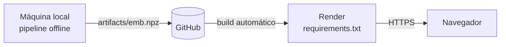

El repositorio versiona el artefacto precomputado. El proveedor de despliegue
instala únicamente el runtime declarado en `requirements.txt` — tres paquetes,
sin el modelo de representación — y sirve la interfaz por HTTPS. El pipeline
offline nunca se ejecuta en producción.